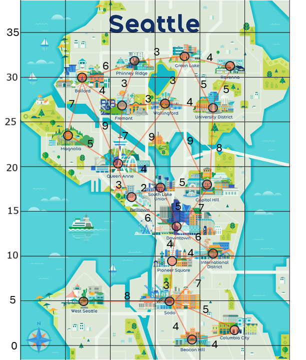
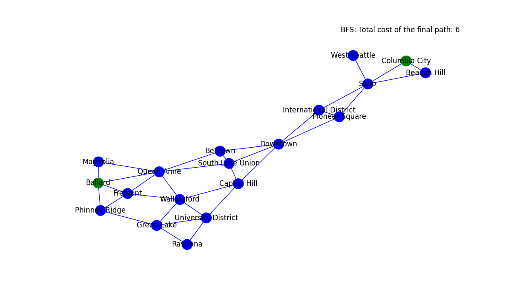
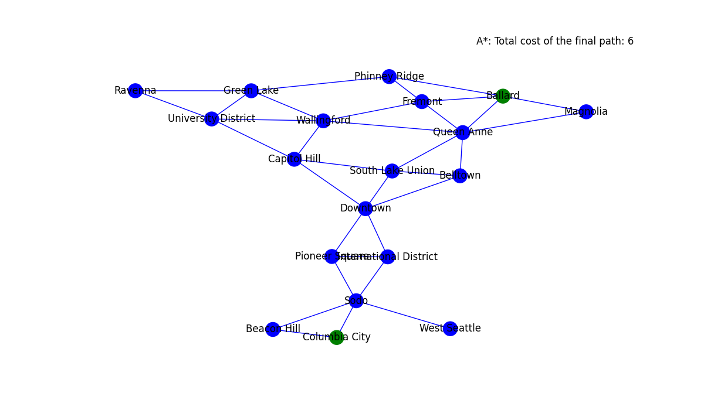
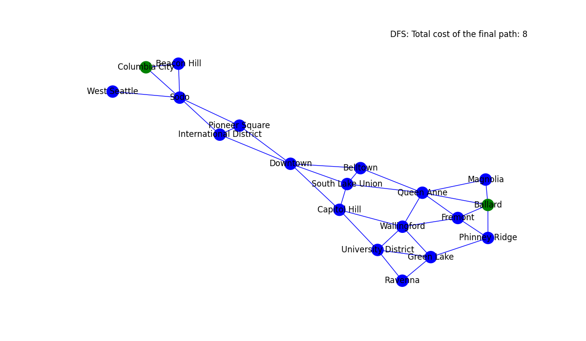

[](https://classroom.github.com/open-in-codespaces?assignment_repo_id=15289839)
# Homework- Seach 🔍🗺️📌🕵️

Topics: BFS, DFS, and A*

## Part 0 - Pre-req

The code uses the NetworkX library [networkx.org](https://networkx.org/) for graph generation and rendering. Documentation can be found [here](https://networkx.org/documentation/stable/tutorial.html). To install, use the command:

```bash
pip install networkx
```

and follow any instructions. Some people have had experinces where pip is not installed. You can find instructions for your environment here [https://pip.pypa.io/en/stable/installation/](https://pip.pypa.io/en/stable/installation/).

If not already installed from other packages, you may also need `numpy` and `matplotlib`. Use the command:

```bash
pip install numpy matplotlib
```

to add those packages.

## Part 1 - Instructions

This assignment is meant to ensure that you:

* Understand the concepts of uninformed and informed search
* Can utilize NetworkX to traverse a graph along edges
* Experience with different search algorithms
* Are able to visualize graphs
* Can argue for chosing one algorithm over another in different contexts

This assignment will provide the following map of Seattle by [The Point Studio](https://dribbble.com/shots/16375676-The-Emerald-City):

[](seattle.png)

Your task is to write a program that will ask the user for a starting neighborhood as well as a destination/goal neighborhood. Then it will find three different paths using BFS, DFS, and A* between those locations. A weighted graph overlay is provided here:

[](seattle_markup.png)

This marked version includes the average driving time between the neighborhoods as the weights of edges showing which are connected and which are not. The grid overlay is for calculating the heuristic _h(x)_ using Euclidean distance. Since your A* search should work on any path between two neighborhoods in the graph, you will need to calculate the proper distance using the coordinate space each time.

You will need to create a datafile that encodes all of the graph information for the given Seattle image into a format which can be read by your program when creating a NetworkX graph. **DO NOT HARDCODE** the graph inside of your Python code.

You will update the [search.py](search.py) file to:

1. Utilize Breath-First-Search, Depth-First Search, and A* Search algorithms built into NetworkX.
2. Complete the functions `mybfs`, `mydfs`, and `myastar` functions to return their respective searches.
    * With BFS and DFS the functions accept a graph, source, and goal returning a list of edges stored as tuples in expansion order i.e. `[(0,1),(0,2),...]`
    * With A*, it returns a tuple containing a list for the complete path from the source to the goal, followed by the total actual cost of that path i.e. `([0,5,9,3],42)`
3. Write functions to visualize the searches on a given graph and save the images to display in the README.
4. Answer the questions in the reflection.

Also note that for A*, the output format of `(path,cost)` is saying to return a tuple containing two items. The first is a list of nodes called `path` like `[4,9,3,11]` and the second item is a number representing the cost of the path taking the sum of all of the weights along the edges. There is a function built into `nx` that will compute this for you.

*Imporant* 2: There isn't just one correct way to visualize the graphs. Please visit [NetworkX's documentation](https://networkx.org/documentation/stable/tutorial.html) for lots of additional resources and examples.

Below is an example screenshot drawing a graph with different colored edges (yours does not need to look like this) given the following code:

```python
    # add main code here
    G = nx.balanced_tree(5,2)
    source = 0
    target = 9
    bfs = mybfs(G, source, target)
    print(bfs)
    colors = ['red' if edge in bfs else 'blue' for edge in G.edges()]
    markers = ['green' if node in [source,target] else 'blue' for node in G.nodes()]
    nx.draw(G, edge_color = colors, node_color = markers, with_labels=True)
    plt.savefig("example_bfs.png") #or use plt.show() to display
```



And to visualize a weighted graph edit the following code:

```python
    G = nx.gnm_random_graph(15, 32, seed=0)
    random.seed(0)
    for (u,v) in G.edges():
        G.edges[u,v]['weight'] = random.randint(1,42)
    pos=nx.circular_layout(G)
    nx.draw_networkx(G,pos)
    labels = nx.get_edge_attributes(G,'weight')
    nx.draw_networkx_edge_labels(G,pos,edge_labels=labels)
    plt.savefig("example_astar.png")
```

It creates the following image:




Modify the documentation in the program's comments to describe the changes you made and document your code. Test your program against the Arad to Bucharest example from [Russel & Norvig](https://courses.cs.washington.edu/courses/cse599j/12sp/calendar/Astar.PDF).

### Alterantive to NetworkX

If you would rather generate images using pygame instead of NetworkX, you can. Visit [https://github.com/FinanceSolution/Graph-Editor-Tool](https://github.com/FinanceSolution/Graph-Editor-Tool) for an example of how to do this.

## Part 2 - Generated Images

The images that you generate need to show all of the edges that were expanded as part of the search (except for A* since the built-in only gives the final path), but also clearly identify the final path generated by the search algorith. Below each section, add three clearly labeled images showing the results of the prompted routes. Inside of each image plot, add a footnote (or figure text or title or something similar) that shows the final cost of the path found.





### Connect Ballard to Columbia City

Add you images here

### Connect West Seattle to Magnolia

Add your images here

## Part 3 - Reflection

Update the README to answer the following questions:

1. ChatGPT describes BFS as

    ```text
    Breadth-first search (BFS) is an algorithm for traversing or searching tree or graph data structures. It starts at the tree root (or some arbitrary node of a graph, sometimes referred to as a 'search key') and explores the neighbor nodes first, before moving to the next level neighbours. It uses a queue data structure to keep track of the next node to visit. It is used to find the shortest path between two nodes in a graph.
    ```

    Summarize and then explain what ChatGPT gets right about BFS and what it misses out on.

    ChatGPT correctly describes the basic steps of BFS, that the search explores some data structures and prioritizes exploring nodes at the same level before moving onto deeper level. However, ChatGPT misses the fact that BFS can be used to find the shortest path between two nodes in an unweighted graph, so the search is not applicable to graphs of all conditions.

2. I asked ChatGPT "Does it make sense to use BFS on a Binary Search Tree?" ... it responded with:

    ```text
    It can make sense to use Breadth-first search (BFS) on a Binary Search Tree (BST) in certain situations. One of those situations is when we need to traverse the entire tree level by level, for example, printing all the elements of the tree level by level. The output will be sorted since it is a binary search tree.

    Another example of using BFS on a BST is when we want to find the shortest path between two nodes. Since a BST has the property of being ordered, the shortest path between two nodes is the path that goes through the least number of levels. Since BFS visits the nodes level by level, it will find the shortest path between the two nodes.

    However, in most cases, it is more efficient to use the in-order, pre-order, or post-order traversal specific to BSTs, since they are designed to take advantage of the tree's ordered structure.
    ```

    Explain why ChatGPT is completely wrong.

3. Explain when greedy searching can perform worse than uninformed search. Create a graph that demonstrates this and include the generated images below. _Hint_ you may need to create some fake data but in the same format that you used to encode the Seattle data.

Greedy search can perform worse than uninformed search when greedy fails to search through the node that would deliver optimal option 
in the long run, as greedy search could eliminate certain nodes early on and does not get to explore all nodes.

4. Try reversing directions and going from Columbia City to Ballard. Do you get the same resulting paths for each of the algorithms? Explain why or why not and show the new images below.

5. What are your thoughts about this homework? Did you find any parts particularly challenging? What changes would you make to improve the learning experience for future students?

Since I'm not experienced using networkx graphs, I got stuck pretty early on when I needed to create a graph based on the given data. 
I wish there are more resources provided to deepen understanding of how to use networkx and techniques relevant to this homework.